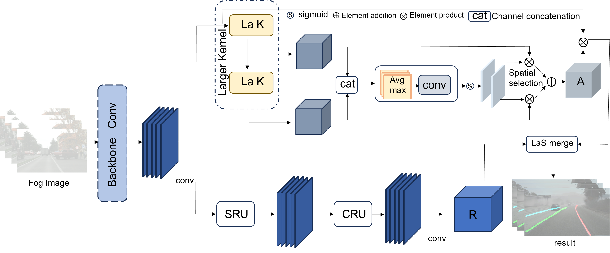

# Enhanced Lane Detection in Foggy Conditions via Adaptive Feature Attention Fusion Network

> The paper code will be released soon...

## Structure

## Datasets

- FogTuSimple 

  链接：https://pan.quark.cn/s/2b9300b23d3c
  提取码：uUCi

## Benchmark

###  Comparison on the FogTuSimple dataset with other methods, where ’-’ repre-
sents unavailable values
| Method   | ACC    | F1     | FP     | FN     | FPS  |
| -------- | ------ | ------ | ------ | ------ | ---- |
| SCNN     | 94.31% | 90.95% | 0.0619 | 0.0729 | 30   |
| LaneNet  | 93.75% | 93.7%  | 0.0821 | 0.0312 | 41   |
| Enet-SAD | 95.23% | 94.42% | 0.0681 | 0.0225 | 33   |
| UFLD     | 94.04% | -      | 0.2157 | 0.0703 | 98   |
| Ours     | 94.62% | 91.17% | 0.0613 | 0.0687 | 43   |

### Comparison with other methods on the FogCULane dataset and the original CULane dataset, the values in the table represent the F1 measurement for each scene

| Category | Enet-SAD (CULane) | Enet-SAD (Fog) | SCNN (CULane) | SCNN (Fog) | UFLD (CULane) | UFLD (Fog) | Ours (CULane) | Ours (Fog) |
| -------- | ----------------- | -------------- | ------------- | ---------- | ------------- | ---------- | ------------- | ---------- |
| Normal   | 90.1%             | 88.6%          | 90.6%         | 83.63%     | 87.7%         | 87.72%     | 77.57%        | 82.63%     |
| Crowded  | 68.8%             | 65.9%          | 69.7%         | 69.63%     | 66.0%         | 65.12%     | 56.37%        | 61.44%     |
| Night    | 66.0%             | 64.3%          | 66.1%         | 66.10%     | 61.8%         | 62.14%     | 54.09%        | 58.89%     |
| No-line  | 41.6%             | 38.7%          | 43.4%         | 37.66%     | 40.2%         | 35.84%     | 31.39%        | 35.48%     |
| Shadow   | 62.7%             | 66.9%          | 49.0%         | 49.02%     | 58.3%         | 58.36%     | 44.54%        | 50.31%     |
| Arrow    | 84.0%             | 79.5%          | 84.1%         | 72.95%     | 81.8%         | 81.85%     | 65.62%        | 73.07%     |
| Dazzle   | 60.2%             | 58.2%          | 58.5%         | 55.17%     | 58.4%         | 52.47%     | 49.68%        | 53.53%     |
| Curve    | 68.8%             | 65.1%          | 64.4%         | 57.22%     | 57.9%         | 57.96%     | 51.86%        | 57.07%     |
| Average  | 70.8%             | 68.62%         | 71.6%         | 64.07%     | 68.4%         | 67.07%     | 58.69%        | 65.45%     |
